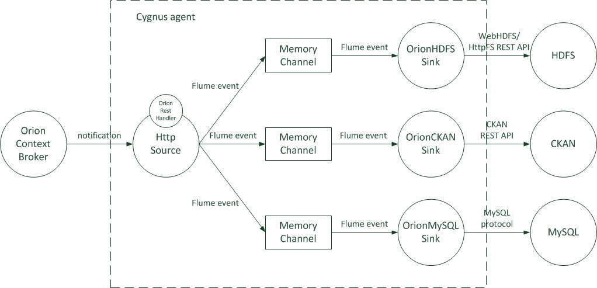
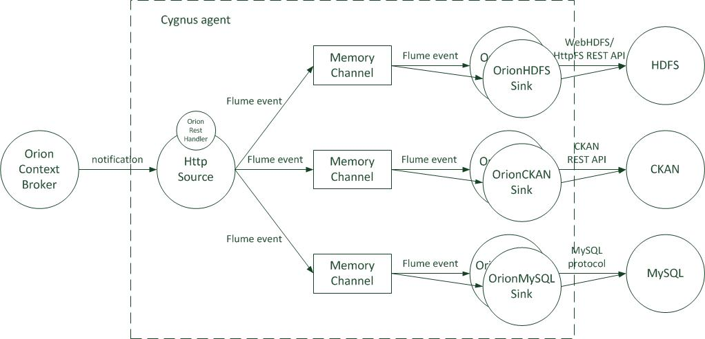
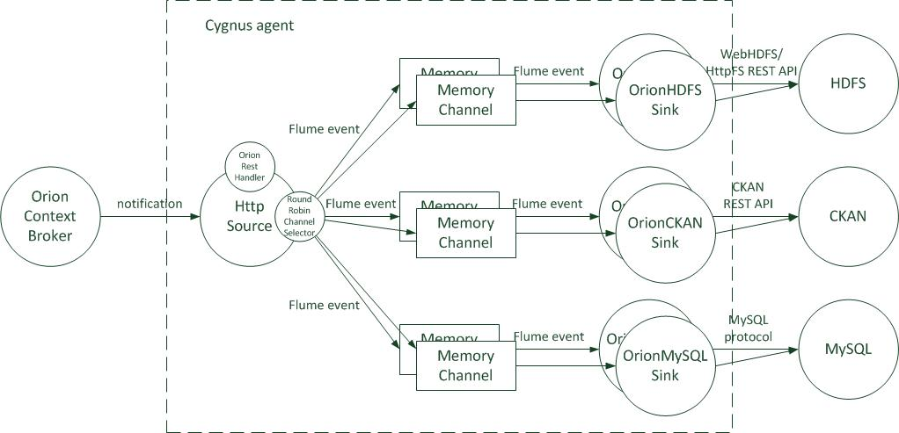
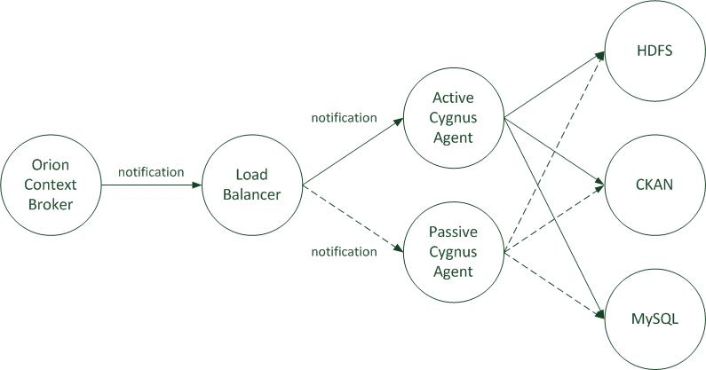

#Cygnus architecture
Cygnus runs Flume agents. Thus, Cygnus agents architecture is Flume agents one. Let's see how this architecture ranges from the most basic configuration to the most complex one.

##Flume architecture
As stated in [flume.apache.org](http://flume.apache.org/FlumeDeveloperGuide.html):

>An Event is a unit of data that flows through a Flume agent. The Event flows from Source to Channel to Sink, and is represented by an implementation of the Event interface. An Event carries a payload (byte array) that is accompanied by an optional set of headers (string attributes). A Flume agent is a process (JVM) that hosts the components that allow Events to flow from an external source to a external destination.

>

>A Source consumes Events having a specific format, and those Events are delivered to the Source by an external source like a web server. For example, an AvroSource can be used to receive Avro Events from clients or from other Flume agents in the flow. When a Source receives an Event, it stores it into one or more Channels. The Channel is a passive store that holds the Event until that Event is consumed by a Sink. One type of Channel available in Flume is the FileChannel which uses the local filesystem as its backing store. A Sink is responsible for removing an Event from the Channel and putting it into an external repository like HDFS (in the case of an HDFSEventSink) or forwarding it to the Source at the next hop of the flow. The Source and Sink within the given agent run asynchronously with the Events staged in the Channel.

[Top](#top)

##Basic Cygnus agent architecture
The simplest way of using Cygnus is to adopt basic constructs/flows of <i>source - channel - sink</i> as described in the Apache Flume documentation. There can be as many basic constructs/flows as persistence elements, i.e. one for HDFS, another one for MySQL, etc. 

For each one of this flows, a [`HttpSource`](http://flume.apache.org/FlumeUserGuide.html#http-source) has to be used. The way this native sources process the Orion notifications is by means of a specific REST handler: `NGSIRESTHandler`. Nevetheless, this basic approach requires each source receives its own event notifications. This is not a problem if the architect clearly defines which flows must end in a HDFS storage, or in a Carto storage, if talking about a NGSI agent. But, what happens if the same event must be stored at HDFS and Carto at the same time? In this case, the constructs are modified in order all of them have the same Http source; then, the notified event is replicated for each channel connected to the source.

Regarding the channels, in the current version of Cygnus all of them are recommended to be of type [`MemoryChannel`](http://flume.apache.org/FlumeUserGuide.html#memory-channel), nevertheless nothing avoids a [`FileChannel`](http://flume.apache.org/FlumeUserGuide.html#file-channel) or a [`JDBCChannel`](http://flume.apache.org/FlumeUserGuide.html#jdbc-channel) can be used.

Finally, the sinks are custom ones, one per each persistence element covered by the current version of Cygnus:

* NGSI sinks:
    * `NGSIHDFSSink`.
    * `NGSIMySQLSink`.
    * `NGSICKANSink`.
    * `NGSIMongoSink`.
    * `NGSISTHSink`.
    * `NGSIPostgreSQLSink`.
    * `NSGICartoDBSink`.
    * `NGSIDynamoDBSink`.
    * `NGSIKafkaSink`.
* Twitter sinks:
    * `TwitterHDFSSink`.
 

[Top](#top)

##Advanced Cygnus architectures
All the advanced archictures arise when trying to improve the performance of Cygnus. As seen above, basic Cygnus configuration is about a source writting Flume events into a single channel where a single sink consumes those events. This can be clearly moved to a multiple sink configuration running in parallel; there are several possibilities:

### Multiple sinks, single channel
You can simply add more sinks consuming events from the same single channel. This configuration theoretically increases the processing capabilities in the sink side, but usually shows an important drawback, specially if the events are consumed by the sinks very fast: the sinks have to compete for the single channel. Thus, some times you can find that adding more sinks in this way simply turns the system slower than a single sink configuration. This configuration is only recommended when the sinks require a lot of time to process a single event, ensuring few collisions when accessing the channel.

[Top](#top)

### Multiple sinks, multiple channels
The above mentioned drawback can be solved by configuring a channel per each sink, avoiding the competition for the single channel.

However, when multiple channels are used for a same storage, then some kind of <i>dispatcher</i> deciding which channels will receive a copy of the events is required. This is the goal of the Flume <i>Channel Selectors</i>, a piece of software selecting the appropriate set of channels the Flume events will be put in. The default one is [`Replicating Channel Selector`](http://flume.apache.org/FlumeUserGuide.html#replicating-channel-selector-default), i.e. each time a Flume event is generated at the sources, it is replicated in all the channels connected to those sources. There is another selector, the [`Multiplexing Channel Selector`](http://flume.apache.org/FlumeUserGuide.html#multiplexing-channel-selector), which puts the events in a channel given certain matching-like criteria. Nevertheless:

* We want the Flume events to be replicated per each configured storage. E.g. we want the events are persisted both in a HDFS and CKAN storage.
* But within a storage, we want the Flume events to be put into a single channel, not replicated. E.g. among all the channels associated to a HDFS storage, we only want to put the event within a single one of them.
* And the dispatching criteria is not based on a matching rule but on a <i>round robin</i>-like behaviour. E.g. if we have 3 channels (`ch1`, `ch2`, `ch3`) associated to a HDFS storage, then select first `ch1`, then `ch2`, then `ch3` and then again `ch1`, etc.

Due to the available <i>Channel Selectors</i> do not fit our needs, a custom selector has been developed: `RoundRobinChannelSelector`. This selector extends [`AbstractChannelSelector`](https://flume.apache.org/releases/content/1.4.0/apidocs/org/apache/flume/channel/AbstractChannelSelector.html) as [`ReplicatingChannelSelector`](http://flume.apache.org/FlumeUserGuide.html#replicating-channel-selector-default) and [`MultiplexingChannelSelector`](http://flume.apache.org/FlumeUserGuide.html#multiplexing-channel-selector) do.

[Top](#top)

##High availability Cygnus architecture
High Availability (or HA) is achieved by replicating a whole Cygnus agent, independently of the internal architecture (basic or advance), in an active-passive standard schema. I.e. when the active Cygnus agent fails, a load balancer redirects all the incoming Orion notifications to the passive one. Both Cygnus agents are able to persist the notified context data using the same set of sinks with identical configuration.

 

Please observe the described configuration shows a little drawback: when migrating from the old active Cygnus (now passive) to the new active one (previously passive), the already notified context data to the old active Cygnus is lost, due to this information is stored within its channel in the form of Flume events. Independently of the channel type used in the agent (`MemoryChannel`, `FileChannel` or `JDBCChannel`), this data cannot be retrieved by an external agent. This drawback can only be fixed if a custom channel allowing for external data retrieval is implemented.

[Top](#top)
